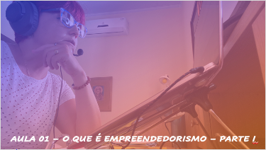
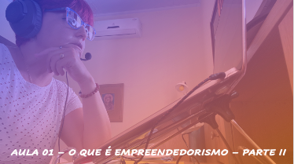

# Empreendedorismo
## Tema aula - O que é empreendedorismo

>  * Apresentação da Disciplina e Principais Conceitos sobre empreendedorismo e habilidades a serem desenvolvidas

## Atividades da aula - Plano de ensino, principais conceitos, vídeo características empreendedor

## Instalação da Disciplina

### Materiais
- [Plano de Ensino](documentos/plano_ensino_empreendedorismo_2025.pdf)
- [Slides aula 01](Aula_1_o_que_e_empreendedorismo.pdf)

### Videos aulas empreendedorismo -  O que é empreendedorismo - Parte I e Parte II

####  O vídeo abaixo mostra as principais características de um empreendedor

### Desenvolvimento aula: 

- [ ]  Apresentação Plano de ensino
- [ ]  Conceitos iniciais
- [ ]  Apresentação pessoal com diferencial (O que te faz diferente em um grupo?)
- [ ]  O processo empreendedor
- [ ]  Principais características de um empreendedor

