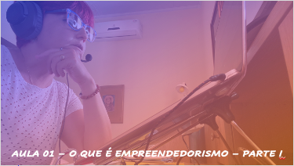
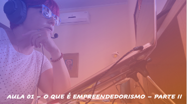

# Empreendedorismo
## Introdução Empreendedorismo e Empreendedorismo Tecnológico e Digital

>  * Dinâmica Diferencial, Apresentação Disciplina (plano de ensino)
>  * Introdução ao empreendedorismo (principais conceitos), empreendedorismo tecnológico e o ser empreendedor

## Instalação da Disciplina

### Materiais
- [Plano de Ensino](plano_ensino_empreendedorismo_2026.pdf)
- [Slides aula 01](Aula_1_Empreendedorismo.pdf)

%%### Videos aulas empreendedorismo -  O que é empreendedorismo - Parte I e Parte II
%%
%%

####  O vídeo abaixo mostra as principais características de um empreendedor

### Desenvolvimento aula: 

- [ ]  Apresentação Plano de ensino
- [ ]  Conceitos iniciais
- [ ]  Apresentação pessoal com diferencial (O que te faz diferente em um grupo?)
- [ ]  O processo empreendedor
- [ ]  Principais características de um empreendedor

