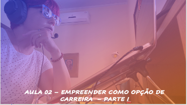
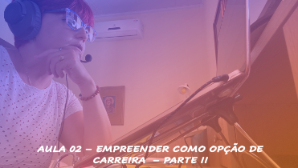

# Aula 02 - Empreendedorismo
## Tema aula - Empreender como opção de carreira

> * Compreender os conceitos acerca do desenvolvimento de um negócio próprio, etapas principais, criar com limites

## Atividades da aula - Conceitos sobre empreendedorismo como uma opção de carreira e criar com limites

## Instalação da Disciplina

### Materiais
- [Slides aula 02](Aula_2_empreender_como_opcao_de_carreira.pdf)

### Videos aulas empreendedorismo -  O que é empreendedorismo - Parte I e Parte II

### Desenvolvimento aula 01: 

- [ ]  Perfil do empreendedor
- [ ]  Razões para empreender (Sobrevivência, Paixão, Investimento, Lutar por uma causa)
- [ ]  Definição grupos de empreendedores (mínimo 2 e máximo 5)

### Desenvolvimento aula 02: 
- [ ]  Criando com limites (Criar um programa de rádio para anunciar propaganda de 1 produto, a escolha da dupla (cigarro, sabonete, pasta de dente). Porém, ao criar essa propagandas, é proibido ouso das seguintes palavras:
- Cigarro: fumar, cigarro, hálito, prazer, nicotina, maço, tragada, sabor, acender.
- Pasta de dente: dentes, hálito, pasta, refrescante, cáries, sabor, flúor, escova.
- Sabonete: banho, suave, higiene, sabonete, beleza, espuma, perfume, limpeza, corpo.
- [ ]  Proponha um negócio que reflita sua motivação para empreender. 
