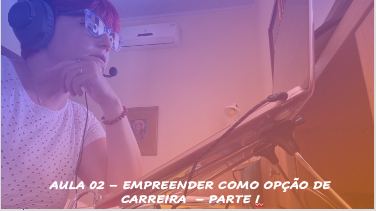

# Aula 03 - Empreendedorismo
## Tema aula - Oportunidades de Negócio - Parte I

> Aula 09/11/2021
> 
> * Compreender os conceitos sobre inovação e diferenças em uma empresa de tecnologia

## Atividades da aula - Apresentar os conceitos sobre inovação e a necessidade de introduzir inovação em produtos de tecnologia

## Instalação da Disciplina

### Materiais
- [Slides aula 03](Aula_3_oportunidades de negócio.pdf)

### Videos aulas empreendedorismo -  O que é empreendedorismo - Parte I e Parte II

####  Atividade frequência para quem não participou da aula síncrona - Prazo 03/11/2021

- [Atividade](https://forms.gle/eHx6ScGicwNzZ2ZHA)

### Desenvolvimento aula 02: 

- [ ]  Perfil do empreendedor
- [ ]  Razões para empreender (Sobrevivência, Paixão, Investimento, Lutar por uma causa)
- [ ]  Definição grupos de empreendedores (mínimo 2 e máximo 2)
- [ ]  Criando com limites (Criar um programa de rádio para anunciar propaganda de 1 produto, a escolha da dupla (cigarro, sabonete, pasta de dente). Porém, ao criar essa propagandas, é proibido ouso das seguintes palavras:
- Cigarro: fumar, cigarro, hálito, prazer, nicotina, maço, tragada, sabor, acender.
- Pasta de dente: dentes, hálito, pasta, refrescante, cáries, sabor, flúor, escova.
- Sabonete: banho, suave, higiene, sabonete, beleza, espuma, perfume, limpeza, corpo.
- [ ]  Proponha um negócio que reflita sua motivação para empreender. 

