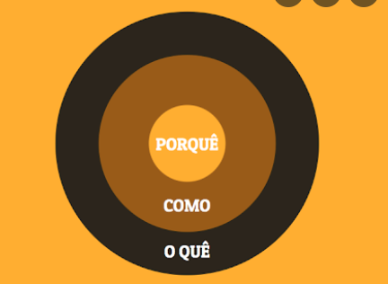

# Empreendedorismo
## Tema aula - Design Thinking: Como transformar Problemas Reais em Soluções Inovadoras

> * O processo de design thinking como forma de identificação de oportunidades de negócios
> * Atividades da aula - Conceitos iniciais Design Thinking, Vídeo ideo card, Vídeo Círculo dourado de Simon, Design Thinking como um processo de imersão, ideação, prototipação e desenvolvimento. Exemplo mesa empresa e pizza em família. Brainstorming e suas regras. Design Thinking no mundo real (problema desnutrição e empresa). Ferramentas o círculo dourado de simon e mapa de empatia para desenvolvimento do negócio, próximas atividades

## Instalação da Disciplina

### Materiais
- [Slides aula 04](Aula_4_Empreendedorismo.pdf)

### Materiais -  Design Thinking 

### Desenvolvimento aula 04 - Parte I: 

- [ ]  Principais Conceitos Design Thinking
- [ ]  Vídeo carrinho de compras IDEO - Melhor explicação do processo criativo que tem-se com o Design Thinking
- [ ]  Vídeo Círculo Dourado de Simon para explicação sobre a importância da forma de se apresentar um produto e conseguir sucesso
- [ ]  Definição dos grupos de trabalho para a disciplina

### Desenvolvimento aula 04 - Parte II: 

- [ ]  Design Thinking como um processo de imersão, ideação, prototipação e desenvolvimento. 
- [ ]  Exemplo mesa empresa e pizza em família. Brainstorming e suas regras. 
- [ ]  Design Thinking no mundo real (problema desnutrição). 
- [ ]  Ferramentas o círculo dourado de Simon e mapa de empatia para desenvolvimento do negócio, próximas atividades.

