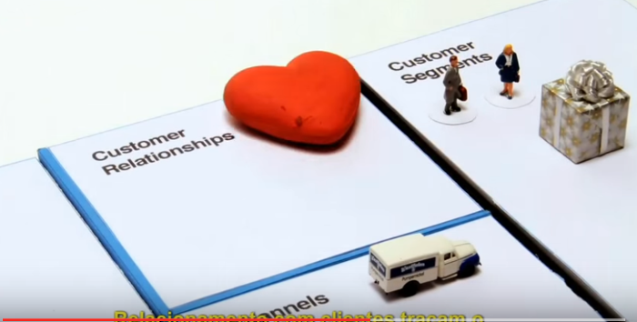
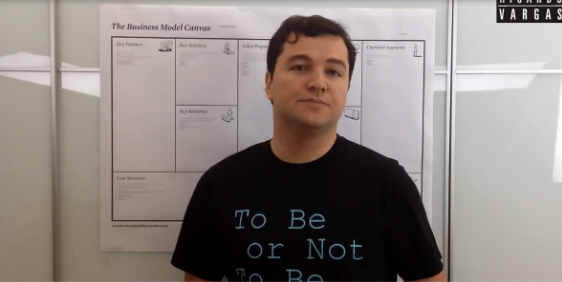

# Empreendedorismo
## Tema aula - Modelo Canvas

## Atividades da aula - Conceitos relacionados ao canvas como complemento ao plano de negócios

### Materiais

- [Slides aula 05](Aula_5_Empreendedorismo.pdf)

### Vídeo animação Modelo Canvas

### Vídeo planejamento carreira -  Modelo Canvas 

### Desenvolvimento aula 1: 

- [ ]  Apresentar os 9 blocos que constituem o modelo canvas
- [ ]  Mostrar a importância deste modelo para planejar um novo negócio de forma rapida e com flexibilidade
- [ ]  Apresentar a divisão entre os blocos que independem e os que dependem do cliente
- [ ]  Vídeo animação Modelo Canvas

### Desenvolvimento aula 2: 

- [ ]  Apresentar um exemplo de uso do modelo canvas - Groupon
- [ ]  Mostrar as divisões e onde o mapa de empatia se encaixa no modelo canvas
- [ ]  Apresentar o vídeo de planejamento da carreira por meio do modelo canvas
- [ ]  Apresentar a ferramenta do sebrae para construir o canvas (https://sebraecanvas.com/#/?checkedSAS=true)
- [ ]  Passar a atividade de planejamento da carreira com o uso do Canvas
