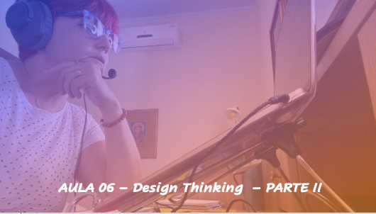
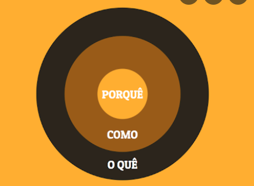

# Aula 06 - Empreendedorismo
## Tema aula - Design Thinking - Parte II

> Aula 16/11/2021
> 
> * O processo de design thinking como forma de identificação de oportunidades de negócios 

## Atividades da aula - Design Thinking como um processo de imersão, ideação, prototipação e desenvolvimento. Exemplo mesa empresa e pizza em família. Brainstorming e suas regras. Design Thinking no mundo real (problema desnutrição e empresa). Ferramentas o círculo dourado de simon e mapa de empatia para desenvolvimento do negócio, próximas atividades

## Instalação da Disciplina

### Materiais
- [Slides aula 06](Aula_6_design_thinking_Parte2.pdf)

### Vídeo aula empreendedorismo -  Design Thinking - Parte I

### Materiais -  Design Thinking - Parte I

####  Atividade frequência para quem não participou da aula síncrona - Prazo 22/11/2021

- [Atividade](https://forms.gle/iErxz3NxtHjNACr86)

### Desenvolvimento aula 04: 

- [ ]  Principais Conceitos Design Thinking
- [ ]  Vídeo carrinho de compras IDEO - Melhor explicação do processo criativo que tem-se com o Design Thinking
- [ ]  Vídeo Círculo Dourado de Simon para explicação sobre a importância da forma de se apresentar um produto e conseguir sucesso
