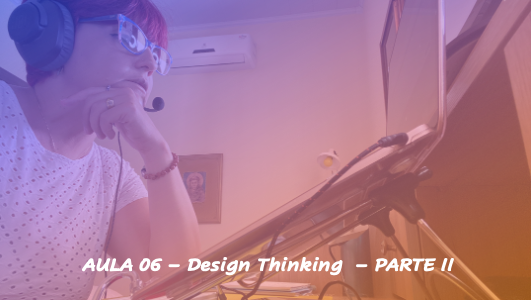

# Empreendedorismo
## Tema aula - Design Thinking - Parte II

> * O processo de design thinking como forma de identificação de oportunidades de negócios 

## Atividades da aula - Design Thinking como um processo de imersão, ideação, prototipação e desenvolvimento. Exemplo mesa empresa e pizza em família. Brainstorming e suas regras. Design Thinking no mundo real (problema desnutrição e empresa). Ferramentas o círculo dourado de simon e mapa de empatia para desenvolvimento do negócio, próximas atividades

## Instalação da Disciplina

### Materiais

- [Slides aula 06](Aula_6_design_thinking_Parte2.pdf)

### Vídeo aula empreendedorismo -  Design Thinking - Parte II

### Desenvolvimento aula 06: 

- [ ]  Design Thinking como um processo de imersão, ideação, prototipação e desenvolvimento. 
- [ ]  Exemplo mesa empresa e pizza em família. Brainstorming e suas regras. 
- [ ]  Design Thinking no mundo real (problema desnutrição e empresa). 
- [ ]  Ferramentas o círculo dourado de Simon e mapa de empatia para desenvolvimento do negócio, próximas atividades
