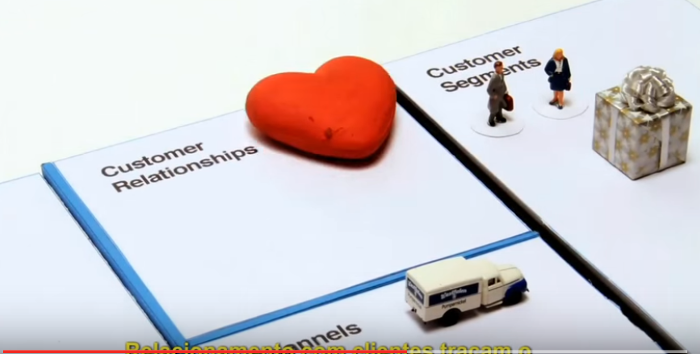

# Empreendedorismo
## Tema aula - Modelo Canvas - Parte I

> Aula 23/11/2021
> 
> * Trabalhar os principais conceitos sobre o modelo canvas

## Atividades da aula - Conceitos relacionados ao canvas como complemento ao plano de negócios

## Instalação da Disciplina

### Materiais

- [Slides aula 07](Aula_7_canvas_parte1.pdf)

### Vídeo aula empreendedorismo -  Modelo Canvas - Parte I

### Vídeo animação Modelo Canvas

### Desenvolvimento aula: 

- [ ]  Apresentar os 9 blocos que constituem o modelo canvas
- [ ]  Mostrar a importância deste modelo para planejar um novo negócio de forma rapida e com flexibilidade
- [ ]  Apresentar a divisão entre os blocos que independem e os que dependem do cliente
- [ ]  Vídeo animação Modelo Canvas
