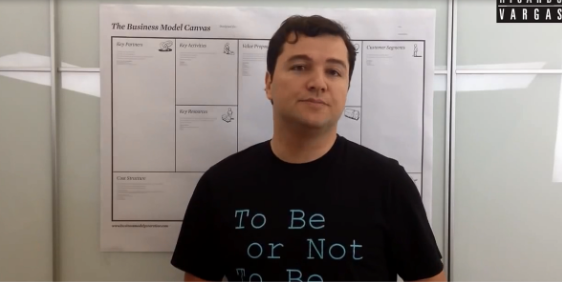

# Empreendedorismo
## Tema aula - Modelo Canvas - Parte II

> * Trabalhar exemplos de uso do modelo canvas, atividade planejamento carreira

## Atividades da aula - Conceitos relacionados ao canvas como complemento ao plano de negócios e atividade para uso do modelo canvas

## Instalação da Disciplina

### Materiais

- [Slides aula 08](Aula_8_canvas_parte2.pdf)

### Vídeo aula empreendedorismo -  Modelo Canvas - Parte II

### Vídeo planejamento carreira -  Modelo Canvas 

### Desenvolvimento aula 07: 

- [ ]  Apresentar um exemplo de uso do modelo canvas - Groupon
- [ ]  Mostrar as divisões e onde o mapa de empatia se encaixa no modelo canvas
- [ ]  Apresentar o vídeo de planejamento da carreira por meio do modelo canvas
- [ ]  Apresentar a ferramenta do sebrae para construir o canvas (https://sebraecanvas.com/#/?checkedSAS=true)
- [ ]  Passar a atividade de planejamento da carreira com o uso do Canvas
