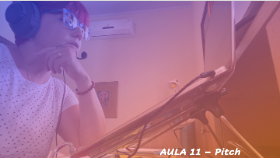
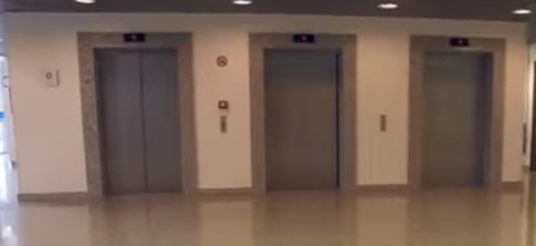

# Aula 11 - Empreendedorismo
## Tema aula - Pitch

> Aula 30/11/2021
> 
> * Trabalhar conceitos sobre pitch e como melhor desenvolver esta poderasa ferramenta para apresentação de ideias inovadoras

## Atividades da aula - Conceitos relacionados ao pitch e como melhor desenvolver um pitch

## Instalação da Disciplina

### Materiais

- [Slides aula 11](Aula_11_pitch.pdf)

### Vídeo aula empreendedorismo -  Pitch

### Vídeo exemplo Pitch

####  Atividade frequência para quem não participou da aula síncrona - Prazo 07/12/2021

- [Atividade]()

### Desenvolvimento aula 07: 

- [ ] O que é Pitch?
- [ ] Como elaborar?
- [ ] Alguns exemplos
