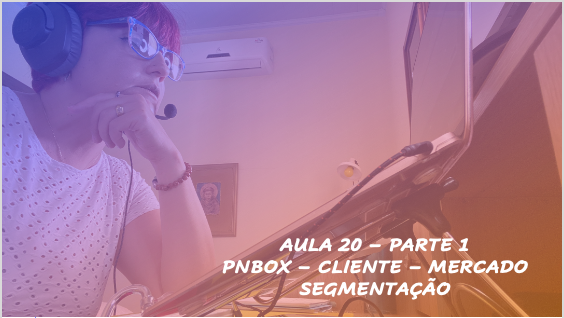
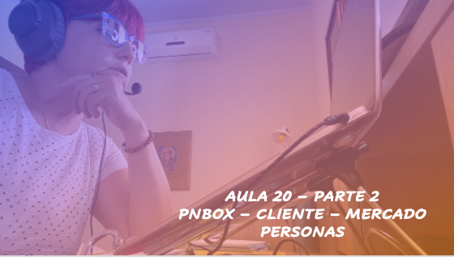
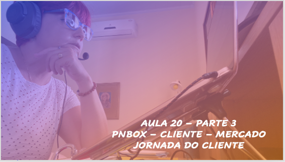

# Aula - Empreendedorismo
## Tema aula - Plano de Negócios - FERRAMENTA PNBOX - SEÇÃO CLIENTE-MERCADO

> * Trabalhar de forma prática os conceitos apresentados sobre cliente e mercado

## Atividades da aula - Nesta aula serão apresentadas as ações necessárias para criar a segmentação de mercado, personas e jornada do cliente

## Instalação da Disciplina - Apresentação da ferramenta pnbox e principais característidcas

### Materiais

- [Slides aula](aula_19_pnbox_cliente_mercado.pdf)

### Vídeo aula empreendedorismo -  PNBOX - CLIENTE MERCADO - SEGMENTAÇÃO

### Vídeo aula empreendedorismo -  PNBOX - CLIENTE MERCADO - PERSONAS

### Vídeo aula empreendedorismo -  PNBOX - CLIENTE MERCADO - JORNADA DO CLIENTE

### Desenvolvimento aula: 

- [ ] Como melhor utilizar a ferramenta pnbox para desenvolvimento do plano de negócios
- [ ] Apresentação das principais características da ferramenta
- [ ] Desenvolvimento da Seção CLIENTE-MERCADO (Segmentação, Personas, Jornada do Cliente)
