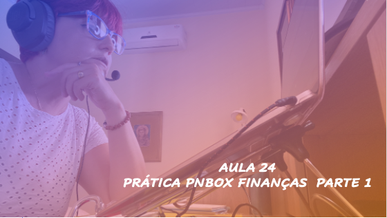
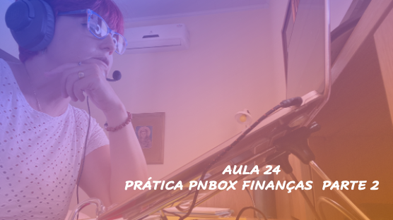

# Aula 24 - Empreendedorismo
## Tema aula - PRÁTICA - FERRAMENTA PNBOX - SEÇÃO FINANÇAS
> 
> * Entender os principais conceitos relacionados a parte de finanças de um negócio, dentre eles Luco, Lucratividade, Rentabilidade

## Atividades da aula - Nesta aula serão apresentadas as seções relacionadas ao planejamento financeiro por meio da ferramenta pnbox

## Instalação da Disciplina - Apresentação da Seção Finanças PNBOX (Investimento, Ganhos, Custos, DRE, Indicadores Financeiros e Simulador de Resultados)

### Materiais

- [Slides aula 23](aula_23_pnbox_financas.pdf)

### Vídeo aula empreendedorismo -  PRÁTICA - PNBOX - FINANÇAS - PARTE 1

### Vídeo aula empreendedorismo -  PRÁTICA - PNBOX - FINANÇAS - PARTE 2

####  Atividade frequência para quem não participou da aula síncrona - Prazo 08/02/2022

- [Atividade](https://forms.gle/P5fsqnprkDLLBid89)

### Desenvolvimento aula 24: 

- [ ] Explicar a Seção Investimento e discutir sobre a dependência das seções em um planejamento financeiro
- [ ] Explicar a Seção Ganhos, Custos 
- [ ] Mostrar como a Seção DRE é preenchida automaticamente conforme as Seções anteriores são preenchidas
- [ ] Voltar a Seção Investimento e preencher Investimento Total
- [ ] Terminar a Seção de Finanças com o preenchimento de indicadores financeiros e Simulador de Resultados com cenário otimista e pessimista.
